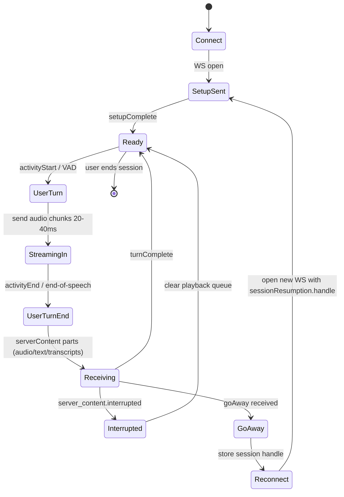

# Uso de Gemini 3.1 Flash Live por API para agentes de voz

## Resumen ejecutivo

Gemini 3.1 Flash Live es un modelo **audio‑a‑audio (A2A)** de baja latencia para diálogo en tiempo real, accesible vía **Gemini Live API** y disponible en **preview**. Su “model code” para la API es `gemini-3.1-flash-live-preview`, con entradas de texto/imagen/audio/video y salidas de texto y audio; además, declara **131,072 tokens de entrada** y **65,536 tokens de salida**. citeturn20view0turn15view0

Si vienes de Gemini 2.5 Flash Live (en la práctica, muchas integraciones usan `gemini-2.5-flash-native-audio-preview-12-2025` en Gemini Developer API o `gemini-live-2.5-flash-native-audio` en Vertex), la migración **no es “drop‑in”**: cambias el string del modelo, migras el control de “thinking” de `thinkingBudget` → `thinkingLevel`, y ajustas tu parser de eventos porque **un solo evento del servidor puede traer múltiples partes** (audio + transcripción en el mismo mensaje). citeturn20view0turn22view0turn11search24turn15view1

En features, 3.1 Flash Live todavía recorta cosas que en 2.5 sí existían en Live API: **no soporta function calling asíncrono**, ni **proactive audio** ni **affective dialogue** (y debes eliminar esas configs si las tenías). citeturn20view0turn22view0

En arquitectura de producción hay dos patrones principales:

- **Server‑to‑server (backend tuyo ↔ Live API)**: más control, credenciales nunca llegan al cliente.
- **Client‑to‑server directo**: recomendado solo si usas **ephemeral tokens**, que expiran rápido y se pueden restringir. citeturn12view3turn12view2

Operativamente, Live API funciona con **WebSockets**, con una conexión que típicamente vive ~10 minutos y un aviso `GoAway` antes de terminar; para conversaciones largas se recomienda **context window compression** y **session resumption** (con tokens de reanudación válidos hasta 2 horas tras terminar la sesión, según la guía de session management). citeturn19view0turn19view1

## Diferencias clave entre Gemini 2.5 Flash Live y 3.1 Flash Live

### Qué cambia de verdad para un agente de voz

Google posiciona 3.1 Flash Live como un salto en **latencia, confiabilidad y naturalidad** frente a 2.5 Flash Native Audio, incluyendo mejor comprensión de tono/énfasis y mejor desempeño en ambientes ruidosos (p. ej., filtrando mejor ruido de fondo) y mejor adherence a system instructions. citeturn14view0turn14view1

En evaluación publicada, el model card de 3.1 Flash Live reporta mejoras sobre 2.5 Flash Native Audio (preview 12‑2025) en benchmarks de audio/diálogo y function calling multistep, como **ComplexFuncBench Audio** (90.8% vs 71.5% para 2.5 preview 12‑2025, según ese mismo card). citeturn14view2turn14view1

En cambio, en APIs/SDKs hay cambios “mecánicos” que te rompen si no los atiendes: sever events multi‑part, restrictions de `send_client_content`, turn coverage por defecto, y la desaparición de features (async function calling, proactive audio, affective dialog). citeturn20view0turn22view0

### Tabla comparativa práctica

| Eje | 3.1 Flash Live | 2.5 Flash Live |
|---|---|---|
| Modelo (Gemini API) | `gemini-3.1-flash-live-preview` citeturn20view0 | Común en producción/preview: `gemini-2.5-flash-native-audio-preview-12-2025` (y otros previews) citeturn20view0turn11search24 |
| “Thinking” | `thinkingLevel` (`minimal/low/medium/high`), default `minimal` (optimiza latencia). citeturn20view0turn22view0turn16view0 | `thinkingBudget` (tokens). Pensamiento dinámico por defecto; `thinkingBudget=0` lo desactiva. citeturn22view0 |
| Estructura de eventos del servidor | Un evento puede traer **múltiples parts** (por ejemplo audio + transcript). Debes iterar todas las parts. citeturn20view0turn22view0 | Cada evento trae **una sola part**; parts llegan en eventos separados. citeturn22view0 |
| `send_client_content` | Solo para “seed” de historia inicial; luego manda texto con `send_realtime_input`. citeturn20view0turn22view0 | Se puede usar durante la conversación para updates incrementales/ contexto. citeturn22view0 |
| Turn coverage (default) | `TURN_INCLUDES_AUDIO_ACTIVITY_AND_ALL_VIDEO` (ojo costos si mandas video continuo). citeturn20view0turn22view0 | `TURN_INCLUDES_ONLY_ACTIVITY`. citeturn22view0 |
| Function calling | Sí, pero **solo secuencial** (bloquea respuesta hasta tool response). citeturn20view0turn22view0 | Soporta function calling **asíncrono** con `behavior: NON_BLOCKING` (según la tabla de Live API). citeturn22view0 |
| Proactive audio / Affective dialogue | **No soportado**. citeturn20view0turn22view0 | Soportado (requiere `v1alpha` para estas configs, según la guía). citeturn22view0 |
| Costeo publicado (Gemini Developer API) | Input audio: $3.00/1M tokens **o** $0.005/min; output audio: $12.00/1M tokens **o** $0.018/min. citeturn15view0 | Para “Native Audio (Live API)” 2.5 preview: input audio/video $3.00/1M; output audio $12.00/1M. citeturn15view1 |

### Formatos de audio y voces

**Formato de audio (Live API):** el audio en Live API es **PCM 16‑bit little‑endian**; la salida siempre es 24 kHz y la entrada es nativamente 16 kHz, aunque la API puede re‑muestrear si mandas otra tasa (debes declarar `mimeType` como `audio/pcm;rate=...`). citeturn22view0

**Voces:**
- En Gemini Live API (Gemini Developer API), los modelos con **native audio output** pueden usar voces tipo TTS; se selecciona con `speechConfig.voiceConfig.prebuiltVoiceConfig.voiceName` (por ejemplo `"Kore"`). citeturn16view0turn22view0  
- En Live API sobre Vertex, la doc enumera **30 voces** (p. ej., Zephyr, Kore, Orus, etc.) y muestra `voice_name`/`language_code` en `SpeechConfig`. citeturn12view0

Sobre **calidad de voz**, Google describe 2.5 Native Audio como optimizado para “pacing, naturalness, verbosity y mood”, mientras 3.1 enfatiza mejor detección de matices acústicos y menor latencia para conversaciones más fluidas. citeturn15view1turn14view0turn20view0

## Requisitos técnicos y autenticación para 3.1 Flash Live

### Endpoints y métodos de autenticación

La Live API es **stateful** y se consume por **WebSockets**. citeturn9view2turn12view2

Tabla de endpoints/credenciales (lo más usado en proyectos de voz):

| Escenario | Endpoint | Auth recomendada | Comentarios |
|---|---|---|---|
| Gemini Developer API (API key) | `wss://generativelanguage.googleapis.com/ws/google.ai.generativelanguage.v1beta.GenerativeService.BidiGenerateContent?key=YOUR_API_KEY` citeturn12view2 | API key | Patrón típico backend‑to‑API o scripts server-side. |
| Gemini Developer API (ephemeral token) | `wss://generativelanguage.googleapis.com/ws/google.ai.generativelanguage.v1alpha.GenerativeService.BidiGenerateContentConstrained?access_token={short-lived-token}` citeturn12view2 | Ephemeral token | Diseñado para client‑to‑server (cliente directo a Live API) con menos riesgo que exponer API keys. citeturn12view3 |
| Vertex Live API (referencia 2.5) | `wss://{LOCATION}-aiplatform.googleapis.com/ws/google.cloud.aiplatform.v1.LlmBidiService/BidiGenerateContent` citeturn13view0 | OAuth2 Bearer token | Se manda `Authorization: Bearer {TOKEN}` en headers de WebSocket. citeturn13view0 |

> Nota importante de disponibilidad: en las páginas oficiales consultadas, **3.1 Flash Live se documenta explícitamente para Gemini API / Google AI Studio**; para Vertex Live API, la documentación pública que vimos enumera modelos Live como `gemini-live-2.5-flash-native-audio` y no lista un “model ID live” de 3.1 Flash Live (no especificado públicamente en esas páginas). citeturn6search1turn14view2turn20view0

### Ephemeral tokens en producción

Los ephemeral tokens son **solo para Live API**, y existen para reducir el riesgo de filtrar una API key en apps cliente. citeturn12view3

Detalles relevantes (porque impactan tu arquitectura):

- `newSessionExpireTime` (por defecto ~1 minuto) limita cuánto tiempo tienes para **iniciar** nuevas sesiones con ese token; `expireTime` (por defecto ~30 min) limita cuánto tiempo puedes **enviar mensajes** en sesiones creadas con ese token. citeturn12view3turn9view3  
- Puedes restringir un token a un conjunto de configuraciones (“constraints”) y controlar `uses` (por defecto 1). citeturn12view3turn9view3  
- Si usas ephemeral tokens, la guía indica que normalmente necesitarás **session resumption** para reconectar cada ~10 minutos dentro del `expireTime`. citeturn12view3turn19view0

En raw WebSockets, la referencia también documenta el uso de tokens efímeros vía `access_token` query param o header `Authorization` con el esquema `Token ...`. citeturn9view3turn12view3

### Cuotas y rate limits

En Gemini API, los límites se expresan típicamente como **RPM**, **TPM** (tokens/min) y **RPD** (requests/día), y se aplican **por proyecto**; además, varían por modelo y por “usage tier”, y los modelos preview suelen tener límites más restrictivos. citeturn7view0

Punto clave práctico: Google no publica en esa página un número único de RPM para cada modelo, sino que te manda a ver los límites activos en AI Studio; por tanto, para 3.1 Flash Live, el detalle exacto de rate limit por cuenta/proyecto puede quedar como **no especificado públicamente** y debes verificarlo en tu proyecto. citeturn7view0

En Vertex Live API (2.5), la guía pública menciona **hasta 1,000 sesiones concurrentes por proyecto** en plan PayGo. citeturn12view1

## Integración práctica para agentes de voz con Live API

### Flujo de integración recomendado

```mermaid
flowchart LR
  U[Usuario con micrófono] -->|Audio 48kHz float (típico)| C[Cliente: web/mobile]
  C -->|Resample a PCM16 16kHz + chunks 20-40ms| B[Backend (opcional)]
  B -->|WebSocket Live API| G[Live API session]
  G -->|Audio PCM16 24kHz + eventos| B
  B -->|Playback + UI + tools| C
  C --> U

  C -. (alternativa) .->|WebSocket directo + ephemeral token| G
```

- El salto “cliente → backend” es opcional: si vas **directo desde cliente** a Live API, usa **ephemeral tokens** (y asume que igual hay riesgo si tu backend de tokens está mal protegido). citeturn12view3turn12view2  
- La recomendación de chunking pequeño (20–40 ms) y resampling a 16 kHz aparece explícita en best practices. citeturn19view1turn22view0  

### Eventos que debes manejar sí o sí

1) **Audio de salida** llega en `serverContent.modelTurn.parts[].inlineData` (base64). citeturn22view0  
2) **Interrupciones (barge‑in)**: si el usuario habla mientras el modelo responde, el servidor manda `server_content.interrupted: true` y debes vaciar tu buffer/cola de playback para no “hablar encima”. citeturn19view1turn22view0  
3) **GoAway**: aviso previo a cierre de conexión; úsalo para reconectar con session resumption. citeturn19view0turn19view1  
4) **SessionResumptionUpdate**: te da el handle más reciente reanudable; guárdalo. citeturn19view0turn19view1  
5) **Multi‑parts por evento en 3.1**: tu parser debe iterar todas las parts del evento para no perder audio/transcripción. citeturn20view0turn22view0  

### Prompt de sistema completo recomendado para un agente de voz

Este estilo sigue las best practices: persona → reglas conversacionales → tools → guardrails. citeturn19view1

```text
Eres “Sofía”, un agente de voz para soporte y automatización de tareas en una empresa.

PERSONA
- Hablas de forma clara, calmada y natural.
- Respondes SIEMPRE en español.
- RESPOND IN SPANISH. YOU MUST RESPOND UNMISTAKABLY IN SPANISH.
- Tus respuestas por voz deben ser cortas (1 a 3 frases), a menos que el usuario pida más detalle.

REGLAS CONVERSACIONALES
1) Inicio: saluda y pregunta en qué puede ayudarte.
2) Clarificación: si falta un dato para ejecutar una acción, haz UNA sola pregunta concreta.
3) Confirmación: antes de ejecutar acciones que cambien estado (crear/cancelar/editar), confirma con el usuario en una frase.
4) Turnos: no interrumpas al usuario; si el usuario habla mientras tú hablas, detente y prioriza escuchar.
5) No repitas lo que el usuario dijo; añade información nueva o avanza el proceso.

HERRAMIENTAS (SI EXISTEN)
- Solo llama herramientas cuando tengas los parámetros mínimos.
- Si una herramienta falla, explica brevemente el fallo y ofrece una alternativa.

GUARDRAILS
- No inventes datos de cuentas, pedidos, pagos o identidad.
- Si el usuario pide algo inseguro o ilegal, rechaza y ofrece alternativas seguras.
- Si no sabes algo, dilo y pregunta el dato exacto necesario.
```

La línea “RESPOND IN … YOU MUST RESPOND UNMISTAKABLY …” está recomendada en documentación para mejorar la estabilidad del idioma (aparece en guías/best practices). citeturn19view1turn12view0

### Ejemplo completo en Node.js con WebSockets crudos

Este ejemplo ilustra: **setup**, streaming de audio en chunks, **activityStart/activityEnd** (VAD manual), manejo de **multi‑parts**, `interrupted`, **GoAway + session resumption**, y errores/reintentos.

Requisitos previos de audio (según specs de Live API): entrada **PCM16 16kHz little‑endian**; salida será PCM16 24kHz. citeturn22view0turn6search6

```js
/**
 * live_agent_node_rawws.js
 *
 * Demo “serio” (pero mínimo):
 * - Se conecta a Live API con API key por query param
 * - Configura sesión con audio output + voiceName
 * - Usa VAD manual (activityStart/activityEnd) para que el modelo responda al final del archivo
 * - Streamea un archivo PCM16 16kHz en chunks de 20ms
 * - Recibe audio PCM16 24kHz en inlineData (base64) y lo guarda en output_24k.pcm
 * - Maneja GoAway + session resumption (reconecta sin perder contexto)
 *
 * Basado en:
 * - Endpoint y auth por query param (v1beta) citeturn12view2
 * - Mensajes setup/clientContent/realtimeInput y eventos (API reference) citeturn9view2
 * - Multi-parts y cambios 3.1 vs 2.5 citeturn20view0turn22view0
 * - Session resumption + GoAway citeturn19view0turn19view1
 */

import fs from "node:fs";
import WebSocket from "ws";

const API_KEY = process.env.GEMINI_API_KEY; // Exporta GEMINI_API_KEY antes de correr
if (!API_KEY) throw new Error("Falta GEMINI_API_KEY en el entorno.");

const MODEL = "gemini-3.1-flash-live-preview";

// Archivo PCM16 mono 16kHz (raw). Ej: input_16k.pcm
const INPUT_PCM = "input_16k.pcm";
const OUTPUT_PCM = "output_24k.pcm";

const WS_URL =
  `wss://generativelanguage.googleapis.com/ws/` +
  `google.ai.generativelanguage.v1beta.GenerativeService.BidiGenerateContent?key=${API_KEY}`;

// 20ms de audio a 16kHz => 320 samples.
// PCM16 => 2 bytes/sample => 640 bytes.
const CHUNK_BYTES = 640;
const CHUNK_INTERVAL_MS = 20;

// Estado global de sesión
let ws = null;
let setupComplete = false;
let resumptionHandle = null;
let reconnecting = false;
let stopping = false;

// Output buffer: escribe PCM24k conforme llega
const outStream = fs.createWriteStream(OUTPUT_PCM);

function buildSetupMessage(handleOrNull) {
  // IMPORTANTE:
  // - Model usa "models/{model}" en Gemini API.
  // - 3.1 exige que proceses multi-parts.
  // - Habilitamos sessionResumption y deshabilitamos VAD automático para controlar turn boundaries.
  return {
    setup: {
      model: `models/${MODEL}`,
      // generationConfig incluye responseModalities y speechConfig (voz)
      generationConfig: {
        responseModalities: ["AUDIO"],
        speechConfig: {
          voiceConfig: { prebuiltVoiceConfig: { voiceName: "Kore" } },
        },
      },
      // Session resumption (si hay handle, reanudar; si no, iniciar)
      sessionResumption: handleOrNull ? { handle: handleOrNull } : {},
      // VAD manual: deshabilita detección automática, así usamos activityStart/activityEnd
      realtimeInputConfig: {
        automaticActivityDetection: { disabled: true },
      },
      systemInstruction: {
        parts: [
          {
            text:
              "Eres un asistente de voz. Responde SIEMPRE en español. " +
              "RESPOND IN SPANISH. YOU MUST RESPOND UNMISTAKABLY IN SPANISH. " +
              "Responde en 1 a 3 frases, a menos que el usuario pida más detalle.",
          },
        ],
      },
      // Opcional: podrías definir tools aquí (function calling). En 3.1 es secuencial. citeturn22view0
    },
  };
}

function sendJson(obj) {
  ws.send(JSON.stringify(obj));
}

function sleep(ms) {
  return new Promise((r) => setTimeout(r, ms));
}

async function connectWithRetry(maxAttempts = 6) {
  let attempt = 0;
  let backoff = 200; // ms

  while (attempt < maxAttempts && !stopping) {
    attempt += 1;
    try {
      await connectOnce();
      return;
    } catch (err) {
      console.error(`[connect] intento ${attempt} falló:`, err?.message ?? err);
      await sleep(backoff);
      backoff = Math.min(backoff * 2, 5000);
    }
  }
  throw new Error("No se pudo establecer WebSocket tras varios intentos.");
}

function connectOnce() {
  return new Promise((resolve, reject) => {
    setupComplete = false;

    ws = new WebSocket(WS_URL);

    ws.on("open", () => {
      // Envia setup y espera setupComplete antes de mandar audio.
      sendJson(buildSetupMessage(resumptionHandle));
      resolve();
    });

    ws.on("error", (e) => {
      reject(e);
    });

    ws.on("close", (code, reason) => {
      if (!stopping && !reconnecting) {
        console.warn(`[ws close] code=${code} reason=${reason?.toString?.() ?? ""}`);
      }
    });

    ws.on("message", (raw) => {
      try {
        const msg = JSON.parse(raw.toString());

        // 1) Setup complete
        if (msg.setupComplete) {
          setupComplete = true;
          console.log("[live] setupComplete");
          return;
        }

        // 2) Session resumption handle updates
        if (msg.sessionResumptionUpdate) {
          const u = msg.sessionResumptionUpdate;
          if (u.resumable && u.newHandle) {
            resumptionHandle = u.newHandle;
            // Persiste esto en DB/cache por conversación si estás en prod.
            console.log("[live] new resumption handle guardado");
          }
        }

        // 3) GoAway: reconectar antes de que muera la conexión
        if (msg.goAway) {
          const timeLeft = msg.goAway.timeLeft;
          console.warn(`[live] GoAway recibido. timeLeft=${timeLeft}. Reconectando...`);
          safeReconnect();
          return;
        }

        // 4) Server content (AUDIO/TEXT/transcripts). En 3.1 puede venir multi-part. citeturn22view0
        if (msg.serverContent) {
          const sc = msg.serverContent;

          // Interruption signal: vacía playback y descarta buffers si estabas reproduciendo
          if (sc.interrupted === true) {
            console.warn("[live] interrupted=true (barge-in). Limpia colas de playback en tu app.");
          }

          // Audio chunks: serverContent.modelTurn.parts[].inlineData.data (base64)
          const modelTurn = sc.modelTurn;
          if (modelTurn?.parts?.length) {
            for (const part of modelTurn.parts) {
              if (part.inlineData?.data) {
                const audioChunk = Buffer.from(part.inlineData.data, "base64");
                outStream.write(audioChunk);
              }
              if (part.text) {
                // A veces también llega texto si incluyes responseModalities con TEXT.
                console.log("[model text]", part.text);
              }
            }
          }

          if (sc.outputTranscription?.text) {
            console.log("[output transcript]", sc.outputTranscription.text);
          }
          if (sc.inputTranscription?.text) {
            console.log("[input transcript]", sc.inputTranscription.text);
          }

          if (sc.generationComplete) {
            console.log("[live] generationComplete");
          }
          if (sc.turnComplete) {
            console.log("[live] turnComplete");
          }
        }

        // 5) Tool calls (si defines herramientas). Aquí solo logueamos. En 3.1 es secuencial. citeturn22view0
        if (msg.toolCall) {
          console.log("[toolCall]", JSON.stringify(msg.toolCall));
        }
      } catch (e) {
        console.error("Error parseando mensaje:", e);
      }
    });
  });
}

async function streamPcmFileOnce() {
  if (!fs.existsSync(INPUT_PCM)) {
    throw new Error(`No existe ${INPUT_PCM}. Debe ser PCM16 mono 16kHz raw.`);
  }
  const pcm = fs.readFileSync(INPUT_PCM);

  // Espera setupComplete (la referencia recomienda esperar antes de enviar). citeturn9view2
  while (!setupComplete) await sleep(10);

  // VAD manual: marca inicio de actividad
  sendJson({ realtimeInput: { activityStart: {} } });

  // Streaming por chunks “realtime”
  for (let i = 0; i < pcm.length; i += CHUNK_BYTES) {
    const chunk = pcm.subarray(i, i + CHUNK_BYTES);

    sendJson({
      realtimeInput: {
        audio: {
          mimeType: "audio/pcm;rate=16000",
          data: chunk.toString("base64"),
        },
      },
    });

    await sleep(CHUNK_INTERVAL_MS);
  }

  // VAD manual: marca fin de actividad => el modelo ya puede responder
  sendJson({ realtimeInput: { activityEnd: {} } });

  console.log("[live] audio enviado, esperando respuesta...");
}

async function safeReconnect() {
  if (reconnecting || stopping) return;
  reconnecting = true;

  try {
    // Cierra WS actual
    try {
      ws?.close();
    } catch {}
    // Reabre con el último resumptionHandle (si existe)
    await connectWithRetry();
    console.log("[live] reconectado (session resumption).");
  } finally {
    reconnecting = false;
  }
}

async function main() {
  try {
    await connectWithRetry();

    // Ejemplo: un “turno” de usuario mandando un audio pregrabado
    await streamPcmFileOnce();

    // En un agente real:
    // - en vez de leer archivo, alimentas chunks desde mic del usuario
    // - y mantienes la sesión viva con context compression + resumption citeturn19view0turn19view1

    // Espera un rato para recibir la respuesta completa (demo). En prod, esperas turnComplete.
    await sleep(8000);
  } finally {
    stopping = true;
    try {
      ws?.close();
    } catch {}
    try {
      outStream.end();
    } catch {}
  }
}

main().catch((e) => {
  console.error(e);
  process.exit(1);
});
```

**Por qué VAD manual en el demo:** la Live API soporta enviar `activityStart/activityEnd` cuando deshabilitas VAD automático, y eso hace más determinístico cuándo “terminó el turno de usuario” (muy útil para pruebas con audio pregrabado). citeturn9view2turn22view0

### Ejemplo completo en Python con Google GenAI SDK

Este ejemplo se apoya en la guía de **session management** (context compression + resumption + GoAway) y en la guía de **audio formats** y recepción de audio por parts. citeturn19view0turn22view0

```python
"""
live_agent_python_sdk.py

- Conecta a Live API con Google GenAI SDK (server-to-server)
- Configura: response_modalities audio, voice_name, context_window_compression, session_resumption
- Streamea PCM16 16kHz en chunks de ~20ms
- Recibe audio PCM16 24kHz por parts y lo escribe a output_24k.pcm
- Maneja:
  - multi-parts por evento (3.1) citeturn20view0turn22view0
  - GoAway + session resumption citeturn19view0turn19view1

NOTA: El SDK y/o nombres exactos de campos pueden variar por versión; lo “estable” es el
contrato conceptual (sessionResumptionUpdate, goAway, serverContent.modelTurn.parts).
"""

import asyncio
from pathlib import Path
from google import genai
from google.genai import types

MODEL = "gemini-3.1-flash-live-preview"

INPUT_PCM = Path("input_16k.pcm")     # PCM16 mono 16kHz raw
OUTPUT_PCM = Path("output_24k.pcm")   # PCM16 24kHz raw (salida del modelo)

CHUNK_BYTES = 640     # 20ms a 16kHz PCM16 mono
CHUNK_SLEEP = 0.02    # 20ms

def pcm_chunks(data: bytes, chunk_size: int):
  for i in range(0, len(data), chunk_size):
    yield data[i:i + chunk_size]

async def run_one_turn(session: types.LiveSession, pcm_bytes: bytes, out_fh):
  """
  Envía un turno de audio usando VAD manual:
  - activityStart
  - audio chunks
  - activityEnd
  """
  # VAD manual (deshabilitamos automaticActivityDetection en config del setup)
  await session.send_realtime_input(activity_start=types.ActivityStart())

  for chunk in pcm_chunks(pcm_bytes, CHUNK_BYTES):
    await session.send_realtime_input(
      audio=types.Blob(data=chunk, mime_type="audio/pcm;rate=16000")
    )
    await asyncio.sleep(CHUNK_SLEEP)

  await session.send_realtime_input(activity_end=types.ActivityEnd())

  # Recibe hasta turnComplete
  async for msg in session.receive():
    # GoAway: el servidor avisa que va a cerrar conexión; tu app debería reconectar
    if getattr(msg, "go_away", None) is not None:
      # time_left es útil para “wrap up”
      print(f"[GoAway] time_left={msg.go_away.time_left}")

    # session resumption: guarda el último handle reanudable
    if getattr(msg, "session_resumption_update", None) is not None:
      u = msg.session_resumption_update
      if u.resumable and u.new_handle:
        session._last_handle = u.new_handle  # demo: guárdalo fuera de session en tu app

    # Server content: audio por parts. En 3.1 puede venir multi-part.
    sc = getattr(msg, "server_content", None)
    if sc and sc.model_turn and sc.model_turn.parts:
      for part in sc.model_turn.parts:
        if part.inline_data and part.inline_data.data:
          out_fh.write(part.inline_data.data)

    # Interrupción (barge-in): en un cliente real aquí borrarías buffers de playback
    if sc and getattr(sc, "interrupted", False):
      print("[interrupted] limpia buffers de playback")

    if sc and getattr(sc, "turn_complete", False):
      break

async def connect_session(client: genai.Client, previous_handle: str | None):
  """
  Abre sesión Live con:
  - context window compression
  - session resumption (para poder reconectar)
  - VAD manual (automaticActivityDetection disabled)
  """
  cfg = types.LiveConnectConfig(
    response_modalities=["AUDIO"],
    # Voz (ejemplo)
    speech_config=types.SpeechConfig(
      voice_config=types.VoiceConfig(
        prebuilt_voice_config=types.PrebuiltVoiceConfig(voice_name="Kore")
      )
    ),
    # Mantener conversaciones largas: compression citeturn19view0turn19view1
    context_window_compression=types.ContextWindowCompressionConfig(
      sliding_window=types.SlidingWindow()
    ),
    # Session resumption: habilita y/o reanuda citeturn19view0turn19view1
    session_resumption=types.SessionResumptionConfig(handle=previous_handle),
    # VAD manual: activityStart/activityEnd citeturn22view0turn9view2
    realtime_input_config=types.RealtimeInputConfig(
      automatic_activity_detection=types.AutomaticActivityDetection(disabled=True)
    ),
    system_instruction=types.Content(
      role="system",
      parts=[types.Part(text=(
        "Eres un asistente de voz. Responde SIEMPRE en español. "
        "RESPOND IN SPANISH. YOU MUST RESPOND UNMISTAKABLY IN SPANISH. "
        "Responde en 1 a 3 frases."
      ))],
    ),
  )

  return client.aio.live.connect(model=MODEL, config=cfg)

async def main():
  if not INPUT_PCM.exists():
    raise FileNotFoundError("Falta input_16k.pcm (PCM16 mono 16kHz raw).")

  pcm_bytes = INPUT_PCM.read_bytes()

  client = genai.Client()
  handle = None

  # En una app real:
  # - handle debe persistirse por conversación (por ejemplo Redis/DB)
  # - session resumption tokens en Gemini API son válidos ~2h tras terminar sesión citeturn19view0turn19view1
  with OUTPUT_PCM.open("wb") as out_fh:
    async with (await connect_session(client, handle)) as session:
      # hack demo: atributo para retener handle. En prod, tu propio estado.
      session._last_handle = None

      await run_one_turn(session, pcm_bytes, out_fh)

      # Al terminar el turno, si tenemos handle nuevo, guárdalo
      handle = getattr(session, "_last_handle", None)
      if handle:
        print("[session] handle reanudable guardado")

if __name__ == "__main__":
  asyncio.run(main())
```

**Notas de ingeniería del ejemplo (aterrizadas en docs):**
- El audio debe mandarse como PCM16 little‑endian y declarar `mime_type="audio/pcm;rate=16000"`. citeturn22view0  
- 3.1 puede emitir audio + transcript en el mismo evento; por eso se iteran todas las `parts`. citeturn20view0turn22view0  
- Para sesiones largas, la guía recomienda compression y resumption; y best practices agrega que audio acumula tokens rápido (~25 tokens/seg), por lo que conviene compression. citeturn19view0turn19view1  

## Cambios necesarios para migrar proyectos de 2.5 a 3.1

### Checklist de migración (lo mínimo para no romper)

1) **Modelo**: cambia el model string al nuevo code (`gemini-3.1-flash-live-preview`). citeturn20view0  
2) **Thinking**: migra `thinkingBudget` → `thinkingLevel` y decide tu default (si quieres latencia mínima, deja `minimal`). citeturn20view0turn22view0  
3) **Parser de eventos**:
   - Antes (2.5): podías asumir “1 part por evento”.
   - Ahora (3.1): **procesa todas** las parts de cada evento. citeturn20view0turn22view0  
4) **`send_client_content`**:
   - En 3.1 solo para “seed” inicial (history). Luego, texto incremental va por `send_realtime_input(text=...)`. citeturn20view0turn22view0  
5) **Turn coverage / video**: si estabas mandando video frames constantes, ajusta para mandar video solo cuando haya actividad de audio o cuando el caso lo exija, porque el default de 3.1 incluye **audio activity + todo el video** dentro del turno. citeturn20view0turn22view0  
6) **Tooling en vivo**: si usabas function calling asíncrono, cambia el flujo: en 3.1 el modelo queda esperando tu `toolResponse` antes de seguir hablando. citeturn20view0turn22view0  
7) **Elimina configs obsoletas**: `proactive_audio` y `enable_affective_dialog` (3.1 no los soporta). citeturn20view0turn22view0  

### Tabla de mapeo de configuración

| En 2.5 | En 3.1 | Qué implica |
|---|---|---|
| `thinkingBudget` | `thinkingLevel` | Control más “categórico” (niveles). Ajusta tu tuning de latencia/calidad. citeturn22view0turn20view0 |
| Events (1 part/event) | Events (multi‑part/event) | Tu loop de parseo debe iterar `parts[]` siempre. citeturn22view0turn20view0 |
| `send_client_content` durante conversación | `send_client_content` solo “seed” | Cambia a `send_realtime_input(text=...)` para texto durante el diálogo. citeturn22view0turn20view0 |
| async function calling | solo secuencial | Re‑diseña tools para responder rápido o la voz se “congela”. citeturn22view0turn20view0 |
| proactive/affective disponibles | no disponibles | Quita flags, y valida UX sin esos “nice-to-have”. citeturn22view0turn20view0 |

## Despliegue y pruebas

### Latencia: qué medir y cómo

Google insiste en que cada ms importa para naturalidad en conversación (sostiene que 3.1 mejora latencia frente a 2.5). citeturn14view0turn14view1

Métricas recomendadas (prácticas, para agentes de voz):

- **TTFA (time‑to‑first‑audio)**: desde el fin de turno (o `activityEnd`) hasta el primer chunk de `inlineData`.
- **Turn latency total**: hasta `turnComplete`. citeturn19view0turn19view1  
- **Interruption latency**: tiempo desde que el usuario habla hasta que recibes `interrupted=true` (y dejas de reproducir). citeturn19view1turn22view0  
- **Errores de sessão**: frecuencia de `GoAway`, closes inesperados y reconexiones.

### Costos: lo que más pega en producción

Para 3.1 Flash Live, Google publica dos maneras de costear audio: por tokens o por minuto. citeturn15view0  
En audio, la best practice también aclara que el audio acumula tokens rápido (~25 tokens/seg), lo cual influye en costo si tu modalidad de cobro es por token. citeturn19view1

Si activas **Search grounding**, hay cargos por consultas de búsqueda cuando superas el free allowance mensual (y el pricing indica que una solicitud puede disparar una o más queries). citeturn15view0turn15view1

### Seguridad y credenciales

- Si tu app cliente se conecta directo a Live API, usa **ephemeral tokens** (son de vida corta, con defaults de expiración y posibilidad de restricción). citeturn12view3turn9view3  
- Si necesitas conversaciones largas, implementa **session resumption** y maneja `GoAway`. citeturn19view0turn19view1  
- En Gemini API, los rate limits se aplican por proyecto y varían por tier/modelo; en preview suelen ser más restrictivos (planifica throttling y backoff). citeturn7view0  

### Diagrama de streaming y reconexión



Este patrón está alineado con las recomendaciones oficiales: chunks pequeños, manejar `interrupted`, habilitar session resumption y procesar `GoAway`. citeturn19view1turn19view0turn22view0

## Problemas conocidos, limitaciones y estrategia de A/B testing

### Limitaciones y “gotchas” (con impacto real)

- **Preview**: Live API (Gemini API) aparece marcada como preview en docs/referencia; asume cambios sin compatibilidad hacia atrás. citeturn22view0turn9view2  
- **3.1 Flash Live no soporta**: Batch API, caching, code execution, file search, structured outputs, URL context, Google Maps grounding, image generation (según la ficha del modelo). citeturn20view0  
- **Function calling bloqueante** en 3.1: tu UX puede “sentirse congelada” si tus tools tardan; esto cambia tu diseño (timeouts, respuestas parciales, o tools ultra‑rápidas). citeturn20view0turn22view0  
- **Session lifetime y reconexión**: conexión ~10 min, con `GoAway`; para mantener sesiones largas necesitas resumption y/o compression. citeturn19view0turn19view1  
- **Token counting**: en el ecosistema Firebase AI Logic se documenta que Live API no soporta Count Tokens API ni usage metadata para Live API (limitación práctica si tu pipeline depende de eso). citeturn3view0turn3view1  

### Recomendaciones para pruebas A/B

Una estrategia A/B razonable para migración 2.5 → 3.1:

- **Dataset controlado**: clips de audio reales (ruido, acentos, interrupciones) + guiones de tool calling (si aplica).
- **Métricas cuantitativas**: TTFA, turn latency, interrupciones correctas, tasas de tool calling correcto, tasa de “re‑asks” por falta de contexto, costo/minuto.
- **Métricas cualitativas**: naturalidad (MOS interno), “perceived intelligence” en follow‑ups, satisfacción.
- **Paridad de prompts**: mismo system prompt; en 3.1 cuida que el prompt no dependa de proactive/affective si lo usabas. citeturn22view0turn20view0  
- **Prueba “noisy environments”**: Google afirma mejoras en ruido/fiabilidad y en tool triggering en ambientes reales; vale la pena que esa sea una batería explícita en tu A/B. citeturn14view0turn14view1  

## Recursos oficiales prioritarios

- **Ficha del modelo Gemini 3.1 Flash Live Preview (Gemini API)**: capacidades, límites de tokens, features soportadas y notas de migración. citeturn20view0  
- **Live API capabilities guide (Gemini API)**: tabla oficial 3.1 vs 2.5, formatos de audio, VAD, ejemplos de envío/recepción. citeturn22view0  
- **Live API WebSockets API reference (Gemini API)**: contrato de mensajes (`setup`, `realtimeInput`, `clientContent`, `toolResponse`) y detalles de session resumption / tokens efímeros. citeturn9view2turn9view3  
- **Session management with Live API (Gemini API)**: `contextWindowCompression`, `SessionResumptionUpdate`, `GoAway`, validez de tokens de resumption (~2h). citeturn19view0  
- **Ephemeral tokens (Gemini API)**: patrón seguro para conexiones directas desde cliente, expiraciones y restricciones. citeturn12view3  
- **Rate limits (Gemini API)** y **Pricing (Gemini Developer API)**: cómo se miden límites (RPM/TPM/RPD), tiers, y precios específicos de 3.1 Flash Live. citeturn7view0turn15view0  
- **Model card de Gemini 3.1 Flash Live (Google DeepMind)**: benchmarks/evaluación y limitaciones de uso a nivel de modelo. citeturn14view2  
- **Vertex Live API docs (referencia 2.5)**: endpoint regional, auth con bearer token, lifetime/concurrencia y configuración de voces en Vertex. citeturn13view0turn12view0turn12view1